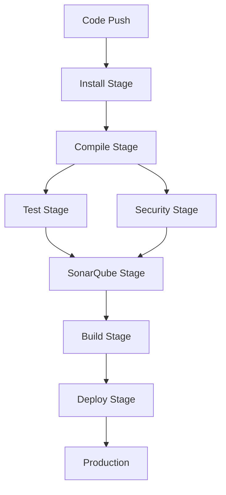

# GitLab CI/CD Pipeline with SonarQube, Trivy & Gitleaks

[](https://gitlab.com)
[](https://www.sonarqube.org/)
[](https://github.com/aquasecurity/trivy)
[](https://github.com/gitleaks/gitleaks)

> **Complete DevSecOps CI/CD Pipeline** for Java Maven projects with integrated code quality analysis, vulnerability scanning, and secret detection.

---

## 📋 Table of Contents

- [Overview](#-overview)
- [Features](#-features)
- [Technology Stack](#-technology-stack)
- [Pipeline Architecture](#-pipeline-architecture)
- [Setup Instructions](#-setup-instructions)
  - [1. SonarQube Setup](#1-sonarqube-setup)
  - [2. GitLab CI/CD Variables](#2-gitlab-cicd-variables-configuration)
  - [3. Runner Configuration](#3-gitlab-runner-setup)
- [Complete Pipeline Code](#-complete-pipeline-code)
- [Security Scanning Setup](#-security-scanning-setup)
- [Pipeline Stages Explained](#-pipeline-stages-explained)
- [Troubleshooting](#-troubleshooting)
- [Best Practices](#-best-practices)

---

## 🎯 Overview

This project provides a **production-ready GitLab CI/CD pipeline** that automates the entire software development lifecycle with integrated security scanning and code quality analysis. Perfect for Java Maven projects requiring enterprise-grade DevSecOps practices.

### What This Pipeline Does

- ✅ Automated build, test, and deployment
- ✅ Code quality analysis with SonarQube
- ✅ Vulnerability scanning with Trivy
- ✅ Secret detection with Gitleaks
- ✅ Artifact management and retention
- ✅ Production deployment ready

---

## 🚀 Features

| Feature | Description |
|---------|-------------|
| **Automated CI/CD** | Complete automation from code commit to deployment |
| **Code Quality** | SonarQube integration for static analysis and bug detection |
| **Security Scanning** | Trivy for CVE detection + Gitleaks for secret scanning |
| **Test Integration** | Unit tests and lint checks with parallel execution |
| **Artifact Management** | Automated JAR builds with configurable retention |
| **Self-Hosted Runner** | Optimized for self-hosted GitLab runners |

---

## 🛠️ Technology Stack

- **GitLab CI/CD** - Continuous Integration & Deployment
- **SonarQube Community** - Code Quality & Security Analysis
- **Docker** - Containerization
- **Trivy** - Vulnerability Scanner
- **Gitleaks** - Secret Detection
- **Apache Maven** - Build Automation
- **OpenJDK 21** - Java Development Kit
- **Ubuntu 22.04** - Base Image

---

## 📊 Pipeline Architecture

```
┌─────────────┐
│   INSTALL   │ → Install Java 21, Maven, Trivy, Gitleaks
└──────┬──────┘
       │
┌──────▼──────┐
│   COMPILE   │ → Maven clean compile
└──────┬──────┘
       │
┌──────▼──────┐
│    TEST     │ → Unit Tests + Lint Checks (Parallel)
└──────┬──────┘
       │
┌──────▼──────┐
│  SECURITY   │ → Trivy Scan + Gitleaks Scan (Parallel)
└──────┬──────┘
       │
┌──────▼──────┐
│ SONARQUBE   │ → Static Code Analysis
└──────┬──────┘
       │
┌──────▼──────┐
│    BUILD    │ → Maven package (Create JAR)
└──────┬──────┘
       │
┌──────▼──────┐
│   DEPLOY    │ → Production Deployment
└─────────────┘
```

---

## ⚙️ Setup Instructions

### 1. SonarQube Setup

#### Step 1: Run SonarQube with Docker

```bash
docker run -d -p 9000:9000 sonarqube:community
```

#### Step 2: Access SonarQube UI

1. Open `http://localhost:9000` in your browser
2. **Default credentials:**
   - Username: `admin`
   - Password: `admin`
3. You'll be prompted to change the password on first login

#### Step 3: Create New Project

1. Click **"Create Project"**
2. Enter project name (e.g., `BoardGame`)
3. Select **"Locally"** as analysis method
4. Generate authentication token
5. **Save the token securely** - you'll need it for GitLab

#### Important Note About This Screen

When you see this screen in SonarQube, **it's NOT an error**. It's telling you which CI/CD variables need to be configured in GitLab.


*This screen shows SonarQube explaining which CI variables are missing. Nothing is broken - just configuration needed.*

---

### 2. GitLab CI/CD Variables Configuration

#### Navigate to Variables Settings

Go to: **GitLab Project → Settings → CI/CD → Variables**


#### Add Variable 1: SONAR_TOKEN

| Property | Value |
|----------|-------|
| **Key** | `SONAR_TOKEN` |
| **Value** | Your SonarQube authentication token |
| **Masked** | ✅ Enabled (checked) |
| **Protected** | ❌ Disabled (unchecked) |

#### Add Variable 2: SONAR_HOST_URL

| Property | Value |
|----------|-------|
| **Key** | `SONAR_HOST_URL` |
| **Value** | `http://localhost:9000` |
| **Masked** | ❌ Disabled (unchecked) |
| **Protected** | ❌ Disabled (unchecked) |

#### Why These Variables Are Required

- **SONAR_TOKEN:** Provides authentication to SonarQube server
- **SONAR_HOST_URL:** Tells SonarQube scanner where the server is running
- **Without these:** Pipeline cannot communicate with SonarQube

#### After Configuration

1. Save both variables
2. Rerun your GitLab pipeline
3. SonarQube analysis will start working
4. The warning screen will disappear

---

### 3. GitLab Runner Setup

Ensure your self-hosted runner:
- Has `sudo` access for package installation
- Is registered with tag `self-hosted`
- Has sufficient disk space (minimum 10GB)
- Runs on Ubuntu/Debian-based system

---

## 📝 Complete Pipeline Code

### Understanding `sonar.java.binaries`


```yaml
sonar.java.binaries=target/classes
```

**What this means:**
- Tells SonarQube where compiled Java `.class` files are located
- `target/classes` is Maven's default output directory
- SonarQube **MUST** find compiled classes to analyze Java code

**Common Error:**
If `target/classes` doesn't exist, you'll get:
- "No files nor directories matching target/classes"
- "Bytecode of dependencies was not provided"

**Solution:**
Always run Maven compile **BEFORE** SonarQube scan.

---

### Full `.gitlab-ci.yml` File

```yaml
image:
  name: sonarsource/sonar-scanner-cli:11
  entrypoint: [""]

variables:
  SONAR_USER_HOME: "$CI_PROJECT_DIR/.sonar"
  GIT_DEPTH: "0"

stages:
  - install
  - compile
  - test
  - sonarqube
  - build
  - deploy

# ---------------- INSTALL ----------------
install-job:
  stage: install
  script:
    - set -euo pipefail
    - export DEBIAN_FRONTEND=noninteractive
    - sudo -n apt-get update
    - sudo -n apt-get install -y openjdk-21-jdk-headless maven
    - java -version
    - mvn -version
  tags:
    - self-hosted

# ---------------- COMPILE ----------------
compile-job:
  stage: compile
  needs:
    - install-job
  script:
    - mvn clean compile
  artifacts:
    paths:
      - target/classes
  tags:
    - self-hosted

# ---------------- UNIT TESTS ----------------
unit-test-job:
  stage: test
  needs:
    - compile-job
  script:
    - mvn test
  artifacts:
    paths:
      - target/classes
    expire_in: 1 week
  tags:
    - self-hosted

# ---------------- LINT TESTS ----------------
lint-test-job:
  stage: test
  needs:
    - compile-job
  script:
    - echo "Linting code..."
    - sleep 10
    - echo "No lint issues found."
  tags:
    - self-hosted

# ---------------- SONARQUBE ----------------
sonarqube-check:
  stage: sonarqube
  needs:
    - compile-job
  cache:
    policy: pull-push
    key: "sonar-cache-$CI_COMMIT_REF_SLUG"
    paths:
      - .sonar/cache
  script:
    - |
      sonar-scanner -X \
        -Dsonar.projectKey=BoardGame \
        -Dsonar.projectName=BoardGame \
        -Dsonar.sources=src \
        -Dsonar.java.binaries=target/classes \
        -Dsonar.host.url="$SONAR_HOST_URL" \
        -Dsonar.login="$SONAR_TOKEN"
  allow_failure: true
  rules:
    - if: '$CI_PIPELINE_SOURCE == "merge_request_event"'
    - if: '$CI_COMMIT_BRANCH == "main"'
    - if: '$CI_COMMIT_BRANCH == "master"'
    - if: '$CI_COMMIT_BRANCH == "develop"'
  tags:
    - self-hosted

# ---------------- BUILD ----------------
build-job:
  stage: build
  needs:
    - unit-test-job
    - lint-test-job
    - sonarqube-check
  script:
    - mvn package
  artifacts:
    paths:
      - target/*.jar
    expire_in: 14 days
  tags:
    - self-hosted

# ---------------- DEPLOY ----------------
deploy-job:
  stage: deploy
  needs:
    - build-job
  environment:
    name: production
  script:
    - echo "Deploying application..."
    - echo "Application successfully deployed."
  tags:
    - self-hosted
```

---

## 🔒 Security Scanning Setup

### What Are Gitleaks and Trivy?

**Gitleaks** - Secret scanning tool that detects hardcoded secrets in code
**Trivy** - Vulnerability scanner that finds CVEs in dependencies


### Why They're Critical

| Tool | Purpose | Risk Prevented |
|------|---------|----------------|
| **Gitleaks** | Secret scanning | API keys, passwords, tokens exposed in code |
| **Trivy** | Vulnerability scanning | Known CVEs in dependencies (Maven, npm, etc.) |

Together they provide:
- ✅ Secrets exposure prevention
- ✅ Dependency vulnerability detection
- ✅ Configuration risk identification

---

### Trivy Installation Process


#### Step-by-Step Installation

```bash
# 1. Add Trivy's official signing key
wget -qO - https://aquasecurity.github.io/trivy-repo/deb/public.key \
  | gpg --dearmor -o /usr/share/keyrings/trivy.gpg

# 2. Add Trivy repository
echo "deb [signed-by=/usr/share/keyrings/trivy.gpg] https://aquasecurity.github.io/trivy-repo/deb generic main" \
  > /etc/apt/sources.list.d/trivy.list

# 3. Update package index
apt-get update

# 4. Install Trivy
apt-get install -y trivy

# 5. Verify installation
trivy --version
```

---

### Complete Pipeline with Security Scanning

```yaml
image: ubuntu:22.04

variables:
  DEBIAN_FRONTEND: noninteractive
  SONAR_USER_HOME: "$CI_PROJECT_DIR/.sonar"
  GIT_DEPTH: "0"

stages:
  - install
  - compile
  - test
  - security
  - sonarqube
  - build
  - deploy

# ---------------- INSTALL ALL TOOLS ----------------
install-all:
  stage: install
  script:
    - apt-get update
    - apt-get install -y openjdk-21-jdk-headless maven wget curl gnupg
    
    # Install Trivy
    - wget -qO - https://aquasecurity.github.io/trivy-repo/deb/public.key 
      | gpg --dearmor -o /usr/share/keyrings/trivy.gpg
    - echo "deb [signed-by=/usr/share/keyrings/trivy.gpg] https://aquasecurity.github.io/trivy-repo/deb generic main" 
      > /etc/apt/sources.list.d/trivy.list
    - apt-get update
    - apt-get install -y trivy
    
    # Install Gitleaks
    - wget https://github.com/gitleaks/gitleaks/releases/download/v8.18.0/gitleaks_8.18.0_linux_x64.tar.gz
    - tar -xzf gitleaks_8.18.0_linux_x64.tar.gz
    - mv gitleaks /usr/local/bin/
    
    # Verify installations
    - java -version
    - mvn -version
    - trivy --version
    - gitleaks version
  tags:
    - self-hosted

# ---------------- COMPILE ----------------
compile-job:
  stage: compile
  needs:
    - install-all
  script:
    - mvn clean compile
  artifacts:
    paths:
      - target/classes
  tags:
    - self-hosted

# ---------------- TEST ----------------
unit-test-job:
  stage: test
  needs:
    - compile-job
  script:
    - mvn test
  artifacts:
    paths:
      - target/classes
    expire_in: 1 week
  tags:
    - self-hosted

lint-test-job:
  stage: test
  needs:
    - compile-job
  script:
    - echo "Linting code..."
    - sleep 10
    - echo "No lint issues found."
  tags:
    - self-hosted

# ---------------- SECURITY SCANNING ----------------
trivy-scan:
  stage: security
  needs:
    - install-all
  script:
    - trivy fs . --format html --output trivy-report.html
  artifacts:
    paths:
      - trivy-report.html
    expire_in: 7 days
  tags:
    - self-hosted

gitleaks-scan:
  stage: security
  needs:
    - install-all
  script:
    - gitleaks detect --source . --report-format json --report-path gitleaks-report.json
  artifacts:
    paths:
      - gitleaks-report.json
    expire_in: 7 days
  allow_failure: true
  tags:
    - self-hosted

# ---------------- SONARQUBE ----------------
sonarqube-check:
  stage: sonarqube
  image:
    name: sonarsource/sonar-scanner-cli:11
    entrypoint: [""]
  needs:
    - compile-job
  cache:
    policy: pull-push
    key: "sonar-cache-$CI_COMMIT_REF_SLUG"
    paths:
      - .sonar/cache
  script:
    - |
      sonar-scanner -X \
        -Dsonar.projectKey=BoardGame \
        -Dsonar.projectName=BoardGame \
        -Dsonar.sources=src \
        -Dsonar.java.binaries=target/classes \
        -Dsonar.host.url="$SONAR_HOST_URL" \
        -Dsonar.login="$SONAR_TOKEN"
  allow_failure: true
  rules:
    - if: '$CI_PIPELINE_SOURCE == "merge_request_event"'
    - if: '$CI_COMMIT_BRANCH == "main"'
    - if: '$CI_COMMIT_BRANCH == "master"'
    - if: '$CI_COMMIT_BRANCH == "develop"'
  tags:
    - self-hosted

# ---------------- BUILD ----------------
build-job:
  stage: build
  needs:
    - unit-test-job
    - lint-test-job
    - trivy-scan
    - gitleaks-scan
    - sonarqube-check
  script:
    - mvn package
  artifacts:
    paths:
      - target/*.jar
    expire_in: 14 days
  tags:
    - self-hosted

# ---------------- DEPLOY ----------------
deploy-job:
  stage: deploy
  needs:
    - build-job
  environment:
    name: production
  script:
    - echo "Deploying application..."
    - echo "Application successfully deployed."
  tags:
    - self-hosted
```

---

## 📖 Pipeline Stages Explained

### 1. Install Stage

**Purpose:** Prepare the runner environment with all required tools

**What happens:**
- Updates package lists
- Installs OpenJDK 21 and Maven
- Installs Trivy vulnerability scanner
- Installs Gitleaks secret scanner
- Verifies all installations

**Why needed:**
Self-hosted runners don't have these tools preinstalled.

---

### 2. Compile Stage

**Purpose:** Compile Java source code

**Key points:**
- Runs `mvn clean compile`
- Creates `target/classes` directory
- Saves compiled classes as artifacts
- Required before SonarQube scan

---

### 3. Test Stage

**Purpose:** Run automated tests (parallel execution)

#### Unit Tests
- Executes `mvn test`
- Tests application logic
- Stores results for 1 week

#### Lint Tests
- Code quality checks
- Currently placeholder (customizable)
- Can add CheckStyle, PMD, SpotBugs

---

### 4. Security Stage

**Purpose:** Security scanning (parallel execution)

#### Trivy Scan
- Scans dependencies for CVEs
- Reads `pom.xml` for vulnerabilities
- Generates HTML report
- Checks against vulnerability database

#### Gitleaks Scan
- Scans Git history for secrets
- Detects API keys, passwords, tokens
- Generates JSON report
- Allows failure (won't block pipeline)


---

### 5. SonarQube Stage

**Purpose:** Static code analysis

**Configuration:**
- `sonar.projectKey`: Project identifier
- `sonar.sources`: Source code location (src)
- `sonar.java.binaries`: Compiled bytecode (target/classes)
- `sonar.host.url`: SonarQube server URL
- `sonar.login`: Authentication token

**Features:**
- Uses cache for faster scans
- Debug logging with `-X` flag
- Allows failure (quality gate)
- Runs on main branches and MRs

---

### 6. Build Stage

**Purpose:** Create deployable artifact

**Process:**
- Runs `mvn package`
- Creates JAR file
- Saves artifacts for 14 days
- Only runs after all previous stages pass

---

### 7. Deploy Stage

**Purpose:** Production deployment

**Current behavior:**
- Simulated with echo commands
- Marks environment as production
- Ready for customization

**Real-world examples:**
- Copy JAR to server via SCP
- Deploy to Kubernetes/Docker
- Update load balancer
- Restart services

---

## 🔧 Troubleshooting

### Issue 1: SonarQube Variables Not Found

**Error:** "SonarQube variables are missing"

**Solution:**
1. Go to GitLab → Settings → CI/CD → Variables
2. Add `SONAR_TOKEN` (masked)
3. Add `SONAR_HOST_URL` (not masked)
4. Rerun pipeline

---

### Issue 2: Target/Classes Not Found

**Error:** "No files matching target/classes"

**Solution:**
Ensure `compile-job` runs before `sonarqube-check`. Check the `needs` dependency in your YAML.

---

### Issue 3: Trivy Database Download Fails

**Error:** "Failed to download vulnerability database"

**Solution:**
- Check internet connectivity
- Verify firewall rules
- Try manual download: `trivy image --download-db-only`

---

### Issue 4: Runner Permission Denied

**Error:** "Permission denied" during apt-get

**Solution:**
- Ensure runner has sudo access
- Add runner user to sudoers
- Or run runner as root (not recommended)

---

### Issue 5: Gitleaks False Positives

**Error:** "Secret detected but it's not real"

**Solution:**
Create `.gitleaksignore` file:

```
# Ignore test files
**/test/**/*.java
# Ignore specific pattern
example-api-key-12345
```

---

## ✅ Best Practices

### Security

- ✅ Always mask sensitive variables (tokens, passwords)
- ✅ Run security scans early in the pipeline
- ✅ Review Trivy and Gitleaks reports regularly
- ✅ Never commit secrets to Git history
- ✅ Use separate tokens for different environments

### Performance

- ✅ Use caching for SonarQube and Maven dependencies
- ✅ Enable parallel execution where possible
- ✅ Set appropriate artifact expiration times
- ✅ Optimize Docker image selection
- ✅ Use `needs` keyword for faster pipelines

### Maintenance

- ✅ Keep tools updated (Trivy, Gitleaks, SonarQube)
- ✅ Review and update security policies quarterly
- ✅ Monitor pipeline execution times
- ✅ Clean up old artifacts regularly
- ✅ Document custom configurations

### Code Quality

- ✅ Set quality gates in SonarQube
- ✅ Fix critical/blocker issues before merge
- ✅ Maintain >80% code coverage
- ✅ Address technical debt regularly
- ✅ Use SonarQube quality profiles

---

## 📊 Pipeline Execution Flow



---

## 🎓 Learning Resources

### Official Documentation
- [GitLab CI/CD Documentation](https://docs.gitlab.com/ee/ci/)
- [SonarQube Documentation](https://docs.sonarqube.org/)
- [Trivy Documentation](https://aquasecurity.github.io/trivy/)
- [Gitleaks Documentation](https://github.com/gitleaks/gitleaks)

### Useful Commands

```bash
# Local SonarQube scan
mvn clean verify sonar:sonar \
  -Dsonar.projectKey=BoardGame \
  -Dsonar.host.url=http://localhost:9000 \
  -Dsonar.login=your-token

# Local Trivy scan
trivy fs . --severity HIGH,CRITICAL

# Local Gitleaks scan
gitleaks detect --source . --verbose

# Maven commands
mvn clean compile      # Compile only
mvn test              # Run tests
mvn package           # Create JAR
mvn clean install     # Full build
```

---

## 🤝 Contributing

Contributions are welcome! Please follow these steps:

1. Fork the repository
2. Create a feature branch (`git checkout -b feature/amazing-feature`)
3. Commit your changes (`git commit -m 'Add amazing feature'`)
4. Push to the branch (`git push origin feature/amazing-feature`)
5. Open a Pull Request

---

## 📄 License

This project is licensed under the MIT License - see the LICENSE file for details.

---

## 📞 Support

For issues and questions:
- 🐛 [Report a Bug](https://github.com/divy1436/GitLab-CI-CD-/issues)
- 💡 [Request a Feature](https://github.com/divy1436/GitLab-CI-CD-/issues)
- 📧 Contact: divyanshu1436@gmail.com

---

## 🌟 Acknowledgments

- GitLab for excellent CI/CD platform
- SonarSource for code quality tools
- Aqua Security for Trivy scanner
- Gitleaks team for secret detection
- Open source community

---

## 📈 Project Status

✅ **Production Ready** - This pipeline is actively used in production environments

**Last Updated:** December 2024

**Version:** 1.0.0

---

<div align="center">

**Built with ❤️ for DevSecOps**

[⭐ Star this repo](https://github.com/divy1436/GitLab-CI-CD-) if you find it helpful!

</div>
